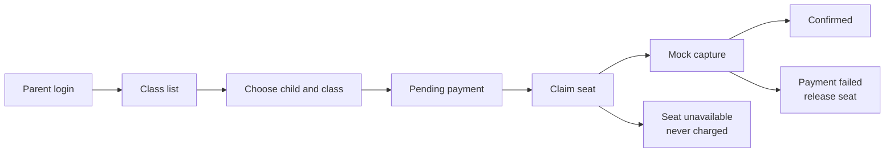
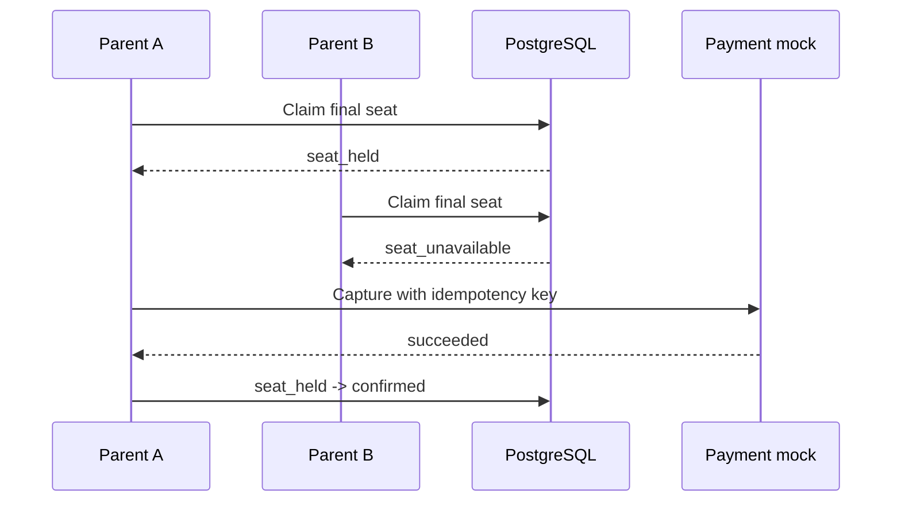

# Trial Booking Reliability

A small mock trial-class booking system for a booking reliability take-home exercise.

The implementation focuses on the backend invariants behind the required edge cases:

- duplicate bookings
- capacity races
- payment failure
- the last-seat race

Regular enrollment, signup, cancellation, waitlists, and scheduled reconciliation are outside the scope.

## Run locally

Requirements: Node.js 22+, pnpm, and Docker.

```bash
cp .env.example .env
pnpm install
docker compose up -d
pnpm db:reset
pnpm dev
```

Open <http://localhost:3000>.

Seeded parent accounts:

| username | children |
| --- | --- |
| `alice` | Ava, Dylan |
| `bob` | Ben, Eli |
| `carol` | Cara |

Admin credentials come from `.env.example`:

```text
username: admin
password: admin
```

`pnpm db:reset` drops the local schema, applies `migrations/*.sql`, and loads `scripts/seed.sql`. The payment mock starts with Next.js through `pnpm dev` on port `4001`.

## User flow



The UI uses plain server-rendered forms. The browser does not need client-side JavaScript for booking.

## Last-seat race

The system claims the seat before capture, at payment submission. Booking creation does not consume capacity, so two parents can reach payment for the same final seat.



The seat claim uses one conditional update:

```sql
UPDATE trial_classes
SET seats_taken = seats_taken + 1
WHERE id = $1 AND seats_taken < capacity
RETURNING seats_taken;
## Manual verification

Manual cases to demonstrate:

1. Log in as `alice` and open the available Science class.
2. To demonstrate a duplicate booking, open Math (class `2`) and choose Ava. Ava
   already has a confirmed booking for that class, so the request returns the existing
   booking instead of creating another one.
3. Submit a payment with the mock outcome set to **Decline**; verify no roster entry
   and restored capacity.
4. Open the Math class in two tabs with two different children and submit both
   payments for the final seat. Exactly one becomes confirmed.
5. Log in as `admin` and inspect the confirmed and operational roster sections.
6. Stop PostgreSQL and reload a class page to see the 500 error state; restart it and
   use the retry path.
## Backend design

### Data model

| table | purpose |
| --- | --- |
| `parents` | seeded parent identities |
| `students` | children linked to a parent |
| `trial_classes` | schedule, price, capacity, and `seats_taken` |
| `bookings` | student/class intent and booking status |
| `payment_attempts` | one provider capture attempt and its result |

IDs use PostgreSQL `bigint` identity columns. Money uses integer cents.

Booking statuses:

- `pending_payment`: booking exists and consumes no seat
- `seat_held`: seat claimed, capture unresolved
- `confirmed`: capture succeeded and the student appears on the roster
- `payment_failed`: capture declined and the seat was released
- `seat_unavailable`: another booking claimed the last seat; no payment was attempted

Payment-attempt statuses:

- `processing`
- `succeeded`
- `failed`
- `unknown`

### Invariants

| concern | enforcement |
| --- | --- |
| capacity | `CHECK (seats_taken <= capacity)` plus conditional claim update |
| duplicate active booking | partial unique index on `(student_id, trial_class_id)` |
| duplicate in-flight capture | partial unique index on `booking_id` for `processing`/`unknown` |
| duplicate settlement | conditional status updates |
| parent ownership | repository query checks the session parent before booking or payment |

The database owns concurrency invariants. The backend owns authorization and state transitions. The UI only disables unavailable classes; it does not provide correctness.

### Main endpoints

| method | endpoint | purpose |
| --- | --- | --- |
| `POST` | `/api/v1/sessions` | parent login |
| `POST` | `/api/v1/sessions/logout` | logout |
| `POST` | `/api/v1/admin/sessions` | admin login |
| `GET` | `/api/v1/classes` | live class availability |
| `POST` | `/api/v1/bookings` | create or return an active booking |
| `POST` | `/api/v1/bookings/:id/payments` | claim, capture, and settle |
| `GET` | `/api/v1/bookings/:id` | booking status |
| `GET` | `/api/v1/admin/classes/:id/roster` | admin roster |
| `POST` | `/api/v1/internal/sweep-holds` | manual stale-hold recovery |

The payment mock exposes `POST /charges`, `GET /charges/:idempotency_key`, and `GET/POST /control`.

## Verification

TypeScript, lint, and production build:

```bash
pnpm exec tsc --noEmit
pnpm lint
pnpm build
```

Critical integration test against PostgreSQL:

```bash
pnpm test
```

The race test creates two pending bookings for a one-seat class and submits both payments concurrently. It checks for exactly one confirmation, one unavailable booking, one payment attempt, and consistent `seats_taken`.

Manual cases to demonstrate:

1. Log in as `alice` and book an available class.
2. Submit a payment with the mock outcome set to `Decline`; verify no roster entry and restored capacity.
3. Open the same class and child in two tabs, then submit both payments for the final seat.
4. Log in as `admin` and inspect the confirmed and operational roster sections.
5. Stop PostgreSQL and reload a class page to see the 500 error state; restart it and use the retry path.

## Assumptions and tradeoffs

- Parents and children are seeded. There is no signup.
- The admin is an environment credential and has read-only roster access.
- Claim-before-capture avoids charging a parent who loses the last seat. It can leave a stale held seat after a process failure, so the system provides a manual sweep endpoint.
- The payment mock persists idempotency results in a local JSON file. A production provider would provide durable charge lookup and scheduled reconciliation.
- Pages use Next.js `src/app`, route handlers, raw `pg`, and constructor-injected repositories. Postgres runs in Docker; Next.js and the payment mock run on the host.

## Deliberate cuts

- No regular enrollment
- No cancellation, waitlist, or reservation expiry
- No scheduled reconciliation worker
- No cross-class schedule conflict check
- No admin audit log
- No refund flow, because losing bookings never reach the provider

## Monitoring after release

Track:

- payment attempts by outcome and latency
- `unknown` attempts and age of held seats
- `seat_unavailable` counts
- duplicate booking conflicts
- database constraint violations
- roster consistency mismatches
- payment-provider lookup and timeout failures

## Next steps

1. Run reconciliation on a schedule instead of manually.
2. Replace the mock with a provider supporting durable idempotency and charge lookup.
3. Add expiry policy and parent-facing recovery for long-lived holds.
4. Add authenticated staff accounts and audit logging.
5. Add end-to-end browser coverage for login, payment, and roster flows.

## Time spent

The implementation exceeded the requested four-hour timebox. Exact elapsed time was not tracked; the README records the scope and remaining production work instead of hiding the overrun.

## Video walkthrough

Add a 5–8 minute walkthrough link before submission. Show setup, the parent flow, the decline path, the last-seat race, and the admin roster.
