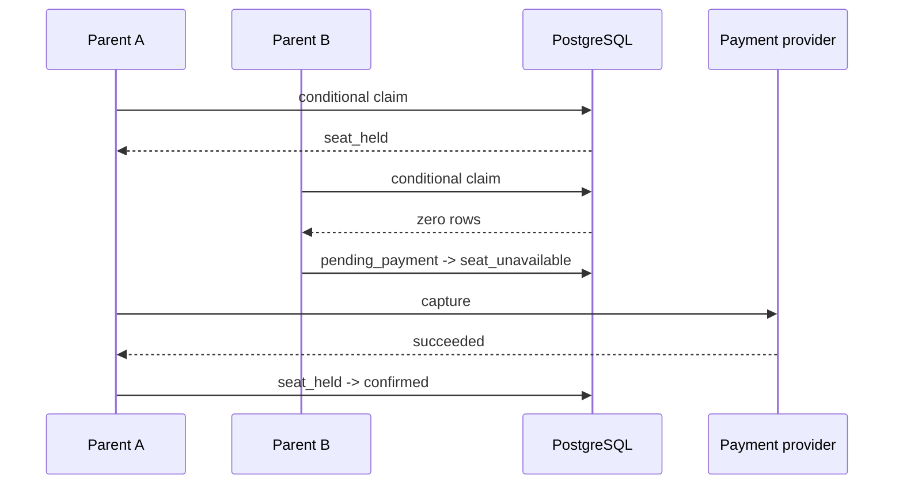

# Booking and Payment State

This document defines every booking and payment state in the trial-booking flow. It
also explains seat ownership, roster visibility, retries, concurrency, and stale
hold recovery.

## Core rules

1. A `pending_payment` booking consumes no seat.
2. A `seat_held` booking consumes a seat but does not appear on the confirmed roster.
3. A `confirmed` booking consumes a seat and appears on the confirmed roster.
4. A failed or unavailable booking consumes no seat.
5. `seats_taken` equals the number of `seat_held` plus `confirmed` bookings.
6. A payment attempt gets one idempotency key. Retries reuse that key.
7. The database decides capacity and active-booking uniqueness. The backend decides
   authorization and state transitions.

## Booking states

| status | meaning | consumes seat | confirmed roster |
| --- | --- | ---: | ---: |
| `pending_payment` | booking exists; payment has not been submitted | no | no |
| `seat_held` | seat claimed; capture is processing or unresolved | yes | no |
| `confirmed` | capture succeeded after seat claim | yes | yes |
| `payment_failed` | capture declined or a safe stale hold was released | no | no |
| `seat_unavailable` | claim lost because the class was full | no | no |

## Payment-attempt states

| status | meaning | can retry with same attempt? |
| --- | --- | ---: |
| `processing` | request was committed and the provider call is in progress | yes, but concurrent callers wait/show progress |
| `succeeded` | provider captured the payment | no; booking should be `confirmed` |
| `failed` | provider declined the capture | no; seat should be released |
| `unknown` | application did not observe the provider result | yes; reuse the same idempotency key |

A payment attempt belongs to one booking and stores the amount, idempotency key,
provider reference, error, and timestamps.

## Complete transition map

```mermaid
stateDiagram-v2
  [*] --> pending_payment: create booking

  pending_payment --> pending_payment: duplicate create; return existing booking
  pending_payment --> seat_held: claim succeeds
  pending_payment --> seat_unavailable: claim still fails after stale cleanup

  seat_held --> confirmed: capture succeeds
  seat_held --> payment_failed: capture declines
  seat_held --> seat_held: capture unknown
  seat_held --> seat_held: retry unknown with same key

  confirmed --> confirmed: repeated payment request; no-op
  payment_failed --> [*]: terminal booking
  seat_unavailable --> [*]: terminal booking
  confirmed --> [*]: terminal booking
```

## Scenario matrix

### 1. Create a new booking

**Input:** valid parent, child owned by that parent, and valid trial class.

```text
no active booking
        |
        v
pending_payment
```

The booking stores the class price in `amount_cents`. It consumes no seat and creates
no payment attempt.

### 2. Create the same booking twice

The active-booking index covers:

```text
(student_id, trial_class_id)
WHERE status IN ('pending_payment', 'seat_held', 'confirmed')
```

Both requests return the same booking. The second request does not create another
row or another payment attempt.

This works across browser tabs and devices because the database key is the domain
identity, not a browser-generated key.

### 3. Rebook after payment failure

```text
old booking: payment_failed
new request: create booking
new booking: pending_payment
```

`payment_failed` is outside the active-booking index, so the parent can try again.

### 4. Rebook after losing a seat

```text
old booking: seat_unavailable
new request: create booking
new booking: pending_payment
```

`seat_unavailable` is also outside the active-booking index. No payment was made for
the old booking.

### 5. Submit payment while the class has capacity

The system runs a conditional claim inside a transaction:

```sql
UPDATE trial_classes
SET seats_taken = seats_taken + 1
WHERE id = $1
  AND seats_taken < capacity
RETURNING id;
```

If the update succeeds:

```text
pending_payment
      |
      | claim succeeds
      v
seat_held + processing payment attempt
```

The transaction commits before the network call. The payment attempt and its
idempotency key therefore survive an application crash.

### 6. Submit payment when the class is full

If the conditional update returns zero rows, the repository first attempts safe stale
hold cleanup and retries the claim once.

If the retry still returns zero rows:

```text
pending_payment -> seat_unavailable
```

The system does not call the payment provider and creates no payment attempt.

### 7. Payment capture succeeds

```text
seat_held + processing
          |
          | provider returns succeeded
          v
confirmed + succeeded attempt
```

The booking appears on the confirmed roster.

### 8. Payment capture declines

```text
seat_held + processing
          |
          | provider returns declined
          v
payment_failed + failed attempt
seat released
```

The booking never appears on the confirmed roster.

### 9. Payment request times out

The provider may have captured the payment even though the application did not receive
the response. The safe state is:

```text
seat_held + processing
          |
          | timeout or aborted response
          v
seat_held + unknown attempt
```

The seat remains held. The system does not release it blindly.

### 10. Retry an unknown payment

The retry uses the existing attempt and its original idempotency key:

```text
unknown attempt
      |
      | provider lookup/replay with same key
      ├── succeeded -> confirmed
      ├── failed    -> payment_failed + seat release
      └── unknown   -> remain seat_held
```

A new key would risk a second charge, so the application never creates a new attempt
while an `unknown` attempt exists.

### 11. A processing attempt exceeds the TTL

If a request dies after committing `processing` but before settling the result, the
next payment submission ages it to `unknown`:

```text
old processing
      |
      | created_at older than HOLD_TTL_SECONDS
      v
unknown
```

The seat remains held and the retry reuses the original key.

### 12. Two parents compete for the last seat



Exactly one booking becomes `confirmed`. The loser becomes `seat_unavailable` and the
provider never sees a charge request for it.

If the requests target the same booking, the booking row lock serializes preparation:

```text
request 1 -> creates processing attempt
request 2 -> sees processing attempt -> shows payment in progress
```

The partial unique index on in-flight attempts remains a database backstop.

### 13. A payment request repeats after settlement

A request for a `confirmed`, `payment_failed`, or `seat_unavailable` booking does not
perform another claim or charge. The service returns the existing terminal result.

### 14. A stale hold has no active attempt

A `seat_held` booking is stale when:

- `held_at` is older than `HOLD_TTL_SECONDS`
- no payment attempt is `processing` or `unknown`

It is safe to release:

```text
seat_held -> payment_failed
seats_taken -= 1
```

The repository performs this lazily when a later claim sees the class as full. The
manual sweep endpoint can also release it.

### 15. A stale hold has a processing or unknown attempt

The system does not release it automatically. The provider may have captured money.

The admin endpoint performs provider lookup:

```http
POST /api/v1/internal/sweep-holds
```

For each `unknown` attempt:

```text
provider says succeeded -> confirmed
provider says failed    -> payment_failed + seat release
provider still unknown  -> leave seat_held
```

A scheduled worker should call this endpoint or the same service logic in production.
The take-home keeps it manual.

### 16. Parent submits another payment while a stale hold exists

The claim path treats the class as full, releases only safe stale holds, then retries:

```text
class appears full
      |
      | release safe stale holds
      v
claim again
      ├── succeeds -> seat_held -> capture
      └── fails    -> seat_unavailable
```

### 17. Invalid or unauthorized request

These do not enter the booking state machine:

- invalid ID → `400`
- child does not belong to logged-in parent → `404`
- booking does not belong to logged-in parent → `404`
- missing/invalid session → redirect or `401`
- unexpected server failure → 500 error page for browser flows

## UI behavior

| state | parent UI | admin roster |
| --- | --- | --- |
| `pending_payment` | payment form | operational section if present |
| `seat_held` + `processing` | payment in progress | held |
| `seat_held` + `unknown` | safe retry action | needs reconciliation |
| `confirmed` | confirmed status | confirmed roster |
| `payment_failed` | failed status | payment failed |
| `seat_unavailable` | unavailable status | seat unavailable |
